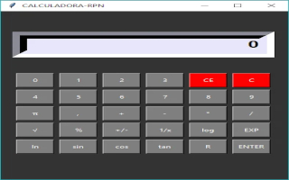
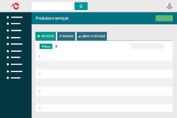
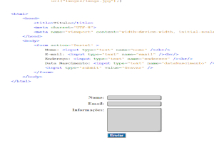

# 
Meu Portfólio

    

Olá, sou <strong>Edson Name</strong>, um estudante apaixonado por **Análise e Desenvolvimento de Sistemas** e **Ciências Contábeis**, com uma grande vontade de aplicar meus conhecimentos para criar soluções inovadoras e práticas. Embora ainda esteja na fase acadêmica da minha jornada, estou determinado a crescer rapidamente e aplicar minha paixão por tecnologia para resolver problemas reais.

Este portfólio é um reflexo do meu esforço constante para aprender, explorar e aprimorar minhas habilidades. Cada projeto que você verá aqui é resultado da minha dedicação em estudar novas tecnologias, aplicar conceitos em situações práticas e buscar a excelência em cada entrega. Mesmo sendo um estudante, busco sempre ir além, aplicando o que aprendo para trazer valor imediato.

Estou em busca de oportunidades para colaborar, aprender com profissionais experientes e contribuir com meu entusiasmo, criatividade e vontade de crescer. Se você procura um estudante dedicado, com uma abordagem fresca e inovadora, estou pronto para enfrentar novos desafios e trabalhar junto a você para transformar ideias em soluções concretas.

---

## 🚀 Projetos

### 1. **Calculadora em Python**
   

      
   

   - **Descrição**: Uma calculadora simples desenvolvida em Python, onde você pode realizar operações básicas como soma, subtração, multiplicação e divisão.
   - **Tecnologias**: Python
   - **Link do projeto**: [Acesse o código aqui](https://github.com/EdsonName/Meu_Portifolio/tree/main/calculadora)
   - **Como rodar**: Baixe o arquivo Python e execute no seu terminal ou IDE.

---

### 2. **Sistema de Gerenciamento de Estoque**
   

      
   

   - **Descrição**: Um sistema de gerenciamento de estoque para empresas, com funcionalidades para adicionar, editar e excluir produtos, além de visualizar o status atual do estoque.
   - **Tecnologias**: Python, SQLite
   - **Link do projeto**: [Acesse o código aqui](https://github.com/EdsonName/Meu_Portifolio/tree/main/sistema_de_estoque)
   - **Como rodar**: Faça o download do código e execute com Python. A base de dados é gerada automaticamente.

---

### 3. **Desenvolvimento de Sites**
   

      
   

   - **Descrição**: Projetos de sites responsivos criados utilizando HTML, CSS e JavaScript. A experiência do usuário foi central para o design e desenvolvimento.
   - **Tecnologias**: HTML, CSS, JavaScript
   - **Link do projeto**: [Acesse o código aqui](https://github.com/EdsonName/Meu_Portifolio/tree/main/desenvolvimento_de_sites)
   - **Como rodar**: Basta abrir o arquivo HTML no seu navegador.

---

## 🧑‍💻 Sobre Mim

Sou estudante de **Análise e Desenvolvimento de Sistemas** e **Ciências Contábeis**, apaixonado por tecnologia e inovação. Ao longo da minha jornada, venho desenvolvendo habilidades técnicas em programação, automação e design de sistemas.

### Habilidades:
- **Programação**: Python, JavaScript, HTML, CSS.
- **Banco de Dados**: SQLite, MySQL. (em aprendizado).
- **Frameworks**: json, React, Node, Bootstrap e Tailwind (em aprendizado).
- **Ferramentas**: Git, GitHub e Visual Studio Code. (em aprendizado).
- **Design e UI/UX**: Noções de design responsivo e usabilidade (em aprendizado).

---

## 📬 Contato

Se você gostaria de discutir sobre algum projeto ou tem interesse em colaborar, entre em contato comigo!

 
  
  <a href="https://wa.me/5561981044986" target="_blank">
    
  </a
    

---

## 📄 Visualize Meu Currículo

Confira meu currículo em PDF para mais informações sobre minha formação e experiências profissionais:

[Visualizar meu Currículo](Currículo - Edson.pdf)

---

    <h4>Obrigado por visitar meu portfólio!</h4>

